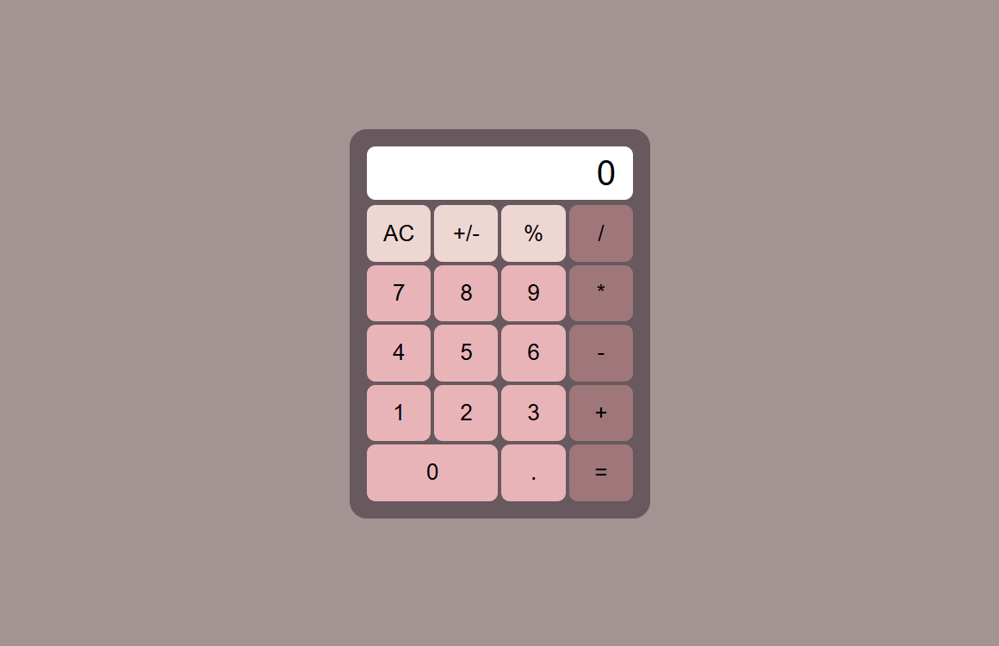

# 🖩Calculator
Calculator is a simple and interactive web application that allows users to perform basic arithmetic operations. This project was built to showcase front-end development skills using HTML, CSS, and JavaScript.



## 🚀 Getting Started
### Run locally
1. Clone the repository:
```bash
git clone https://github.com/potatopotati/My-Terrarium.git
```
2. Navigate into the project directory:
```bash
cd Calculator
```

## 🛠️ Built With
1. HTML
2. CSS
3. Javascript
